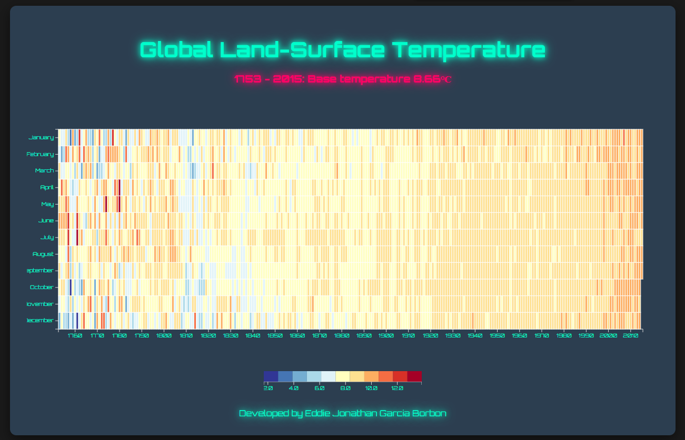

# **Heat Map: Global Land-Surface Temperature**

 <!-- Add a screenshot of your project here -->

Live Demo: [https://eddieborbon.github.io/Heat-Map/ ](https://eddieborbon.github.io/Heat-Map/)

## **Project Description**
This project is an interactive heat map visualizing global land-surface temperature from **1753 to 2015**. Using the **D3.js** library, it provides a stunning visual representation of data, featuring a modern and futuristic design with neon colors and tech-inspired typography.

---

## **Key Features**
- **Interactive Heat Map**: Displays global temperature variations over time.
- **Dynamic Tooltip**: Shows detailed information (year, month, temperature, and variance) when hovering over cells.
- **Futuristic Design**: Neon colors, shadows, and modern typography for a tech-inspired appearance.
- **Legend**: Includes a legend to explain the heat map's color gradient.
- **Developer Credit**: Footer with the developer's name.

---

## **Technologies Used**
- **HTML5**: Project structure.
- **CSS3**: Styling and modern design.
- **JavaScript**: Logic and DOM manipulation.
- **D3.js**: Data visualization library.
- **Google Fonts**: Modern typography (Orbitron and Roboto).

---

## **How to Use**
1. Clone this repository or download the files.
2. Open the `index.html` file in your browser.
3. Interact with the heat map:
   - **Hover** over the cells to see detailed information in the tooltip.

---

## **How to Contribute**
If you'd like to contribute to this project, follow these steps:
1. Fork the repository.
2. Create a new branch (`git checkout -b feature/new-feature`).
3. Make your changes and commit them (`git commit -m 'Add new feature'`).
4. Push to the branch (`git push origin feature/new-feature`).
5. Open a Pull Request.

---

## **Credits**
- **Developed by**: Eddie Jonathan Garcia Borbon
- **Data**: [freeCodeCamp](https://raw.githubusercontent.com/freeCodeCamp/ProjectReferenceData/master/global-temperature.json)
- **Inspiration**: Data visualization projects with D3.js.

---

## **License**
This project is licensed under the **MIT License**. For more details, see the [LICENSE](LICENSE) file.

---

## **Related Links**
- [D3.js Documentation](https://d3js.org/)
- [freeCodeCamp Data Visualization Projects](https://www.freecodecamp.org/learn/data-visualization/)
- [Google Fonts](https://fonts.google.com/)

---

Thank you for checking out this project! If you have any questions or suggestions, feel free to reach out. 😊

---

### **Additional Notes**
- Ensure you have an internet connection to load Google Fonts and the temperature dataset.
- Feel free to customize the design and colors to suit your preferences.
